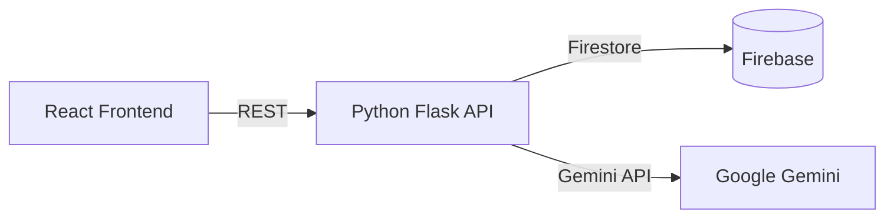

# Lease Shield AI

Lease Shield AI helps tenants decode their lease agreements using Google's Gemini models. Upload a PDF, and the app highlights key clauses, risks and costs in minutes.

## Architecture


## 5‑Minute Demo
1. Copy environment template and fill in your keys:
   ```bash
   cp .env.example .env
   # edit .env to set GEMINI_API_KEY_1 and ADMIN_EMAIL
   ```
2. Start everything with one command:
   ```bash
   docker compose up
   ```
3. Call the Hello API once the containers are running:
   ```bash
   curl http://localhost:8081/api/ping
   # {"status":"pong"}
   ```

## Demo Video
[Watch a quick demo](public/Product%20Launch%20Video.mp4)

## Features
- Secure authentication with Firebase
- PDF upload & AI‑powered analysis
- Interactive dashboard of lease terms and risks

## Tech Stack
- **Frontend:** React, Material UI, Firebase SDK
- **Backend:** Flask, Firebase Admin, Google Generative AI SDK
- **Infrastructure:** Docker, Firebase Firestore & Storage

## Deployment
- Frontend: Firebase Hosting
- Backend: Google Cloud Run

